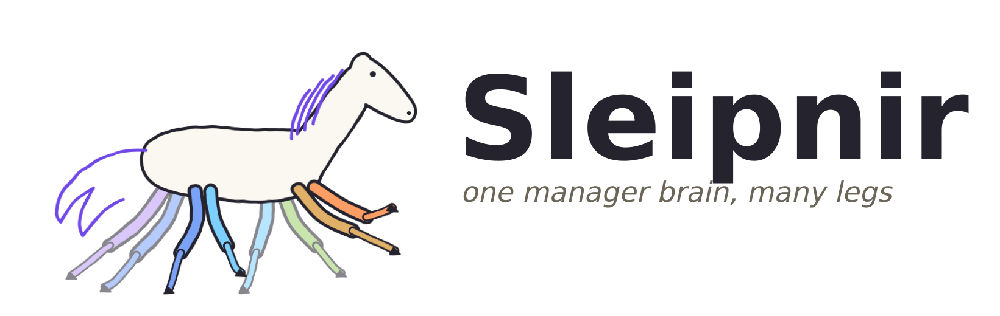

<h1 align="center">
  <picture>
    <source media="(prefers-color-scheme: dark)" srcset="docs/media/logo-wordmark-dark.svg">
    
  </picture>
</h1>

**A coding-agent harness made for open-weight models, local or hosted: one model for everything by default, a different model per
job when you want, and a team of agents that shares one prompt cache.**

[](https://github.com/Anemos-labs/Sleipnir/actions/workflows/ci.yml)
[](https://github.com/Anemos-labs/Sleipnir/actions/workflows/codeql.yml)
[](https://github.com/Anemos-labs/Sleipnir/releases)
[](go.mod)

## Quick start

```sh
curl -fsSL https://raw.githubusercontent.com/anemos-labs/sleipnir/main/scripts/install.sh | sh   # or: go install github.com/anemos-labs/sleipnir/cmd/sleipnir@latest
cd your-project && sleipnir            # first run: pick a provider (Heimdall is the recommended one), paste its key, pick a model; you are then in the chat
```

That is all. The key is kept in `~/.sleipnir/auth.json` (mode 0600) and your choices in `~/.sleipnir/config.json`; the next `sleipnir` opens the
chat at once. `sleipnir run "fix the failing test"` does one goal without the chat, `sleipnir swarm 8 "..."` runs a team. More in
[docs/GETTING-STARTED.md](docs/GETTING-STARTED.md).

<p align="center"></p>

<p align="center"></p>

<p align="center"></p>

*All three are real sessions, recorded as they happened by `scripts/record-real.sh` (a real model, real tools, a person typing; in the first two, waits longer than 1.5 s are shortened; the swarm's cockpit is drawn from its event log, six times faster than it ran: two and a half minutes, $0.0005).*

## What you get

* **Any provider, local or hosted.** Heimdall (recommended), OpenRouter, OpenAI, Anthropic, Together, Fireworks, Groq, Cerebras, DeepInfra, and local
  servers (Ollama, LM Studio, llama.cpp, vLLM) with no key. A searchable list of every model with filters and favorites: `/model` in the chat,
  `sleipnir models`. [Providers](docs/PROVIDERS.md)
* **One model by default, a model per job when you choose.** A frontier manager, an open-weight backend, a small model that writes the compaction
  summaries: `--role-model`, or `models.roles`. [Configuration](docs/CONFIGURATION.md)
* **Made for models that are not perfect.** Plain, complete briefs for every worker; a stuck or looping model is stopped and told why; edits need a
  read first; a test rewritten to match a bug is called out; "done" is the harness's word, after a verifier passed. [Why](docs/WHY.md)
* **Teams that share a cache.** A manager and up to dozens of workers over one repository, each in its own git worktree, finished work through a
  verifying merge queue. [Swarm protocol](docs/SWARM-PROTOCOL.md)
* **You see what it costs.** Tokens, dollars, and what the cache saved, live; compaction at the cheapest moment, never a surprise rewrite.
  [Cache design](docs/CACHE-DESIGN.md), [what the layering buys](docs/CACHE-ECONOMICS.md)
* **Memory and schedules.** Notes it keeps across sessions (each one asks first); goals on a cron schedule that run headless. [Extending](docs/EXTENDING.md)
* **Safe to point at a repository you did not write.** A permission engine, project trust, keys held out of every tool's environment.
  [Security](docs/SECURITY.md)
* **Yours to extend.** Skills, slash commands, agent definitions, hooks, MCP servers. [Extending](docs/EXTENDING.md), [MCP](docs/MCP.md)
* **An RL environment.** The harness records exact-prompt trajectories with verifiable rewards. [Training data](docs/TRAINING-DATA.md)

## Documentation

| start here | |
|---|---|
| [Getting started](docs/GETTING-STARTED.md) | every command in a few lines |
| [CLI reference](docs/CLI.md) | every command, flag and slash command (generated from `--help`) |
| [Configuration](docs/CONFIGURATION.md) | where settings live, every key, permissions, trust |
| [Providers](docs/PROVIDERS.md) | what is supported and how it is measured |
| [Extending](docs/EXTENDING.md) · [MCP](docs/MCP.md) | instruction files, skills, commands, agents, hooks, sessions, tool servers |

| how it works | |
|---|---|
| [Why it is built this way](docs/WHY.md) · [Architecture](docs/ARCHITECTURE.md) | the layers, the decisions, the package map |
| [Cache design](docs/CACHE-DESIGN.md) · [Cache economics](docs/CACHE-ECONOMICS.md) | the planner, the guard, what it saves and where it does not |
| [Swarm protocol](docs/SWARM-PROTOCOL.md) · [Security](docs/SECURITY.md) | board, mail, leases, verifier-gated done · the threat model |
| [Gallery](docs/GALLERY.md) · [UX](docs/UX.md) | the terminal programs |

| the project | |
|---|---|
| [Status](docs/STATUS.md) · [Roadmap](docs/ROADMAP.md) | what is built and tested, what is next (an agent or person picking this up starts at the roadmap) |
| [Benchmarks](docs/BENCHMARKS.md) · [Validation](docs/VALIDATION.md) · [Dogfood](docs/DOGFOOD.md) | measured results, real endpoints, what real use found |
| [Testing](docs/TESTING.md) · [Building](docs/BUILDING.md) · [Repo setup](docs/REPO-SETUP.md) · [Contributing](CONTRIBUTING.md) · [Changelog](CHANGELOG.md) | working on it |
| [Research](docs/research/) · [Reviews](docs/reviews/) · [Landscape](docs/LANDSCAPE.md) | what the design rests on, and what other harnesses do |

## Development

```sh
make build test race lint
scripts/check.sh                       # what CI runs
```

Go 1.25, standard library plus `golang.org/x/{net,sys,term}`. See `AGENTS.md` and `docs/BUILDING.md`.

## License

To be decided before the first release.
