# Gallery

Two kinds of picture are here. The **real recordings** (`real-*.svg`, made by `scripts/record-real.sh`) are real sessions: a real model, real tools, real timing, a person typing; only waits longer than 1.5 s are shortened. The **scripted demos** below them are drawn from a mock model that follows a script (they show the harness around the model, not a model); they were made first and are kept because they show the swarm.

*The first run, in a directory with no configuration (the menus are driven with the arrow keys and enter, typing narrows the model list): `scripts/record-real.sh --scenario first-run --search v4.1-flash --model heimdall/deepseek/deepseek-v4.1-flash --out docs/media/real-first-run.svg`.*

*A real team on three small packages: `scripts/record-real.sh --scenario swarm --model heimdall/deepseek/deepseek-v4.1-flash --out docs/media/real-swarm.svg` (SPEED=6 by default).*

*The chat (a manager that can start seven workers) in a small Go project with a failing test and two functions to add, on a real model; the typist answers every question with the key 1 and ends by opening the stats and agents pages: `scripts/record-real.sh --model heimdall/deepseek/deepseek-v4.1-flash --out docs/media/real-chat.svg --goal 'Slugify turns "Hello, World!" into "hello,-world!" and the test in slug_test.go fails. Fix it so the tests pass. Also add Reverse(s string) string in reverse.go and Truncate(s string, n int) string in truncate.go, each with a test. Give the three parts to three workers, then run the tests.'`.*

`sleipnir demo` (on a terminal; `--scenario shop` anywhere) runs a team of nine agents through the real harness against a mock
endpoint (no key, no network, about twenty seconds; on a terminal you watch it happen in the live cockpit), and `sleipnir replay`
plays any recorded session back. The pictures below are the terminal's own screens,
drawn by the code from recorded sessions and nothing else (`scripts/record-demo.sh`), not mock-ups: the swarm's, the cache's and the
fold's from the event log of that demo, the chat's from a transcript of a chat session. The model in a recording is a
script, so it says nothing clever; everything around it is the real harness: git worktrees, the merge queue and its checks, the mail
router, the cache planner, the governor, the accounting. In the swarm's recording the cache lives 25 seconds instead of minutes, so you
can watch it cool.

**The swarm** (`sleipnir watch`, `sleipnir replay`). Three scouts read the same prefix at once and pay for it once; four workers
each get a git worktree and a scope; the backend mails the frontend what it will serve; the repetition guard tells a worker that has
run the same failing check four times that it is going in circles; the provider loses its cache and every agent that had a warm
one notices; and the merge queue sends the frontend's piece back because, merged with the catalogue's, the shop has two default
ports, each of which was fine in its own tree. The horse has eight legs, one for each rider on the shared prefix: a leg lifts while
its worker runs a tool.

**The chat** (`sleipnir chat`, the program you are in most of the time). A goal is typed into the box and sent; the answer streams
in as markdown (a heading, a list, a code block); every tool call is a line of its own: a read, `go test` failing (a `✗` and the tail
of its output), an edit as a diff with line numbers, the tests passing. The edit asks first, and the question is answered with the
key `1`: it takes numbers (and the arrows and enter), never letters, because a letter is what a half-typed sentence is made of and a
sentence must not be able to answer for you. The person's hand goes to `y` first, as it does at other tools' prompts; it lands in the
input box and the question says why (your typing goes to the prompt until you pause), so it is deleted, and `1` answers. Under the
thread is the status line (spinner, verb, elapsed time, tokens, cost), the input and a footer that names the keys of the stats page
(`ctrl+t`) and, for a team, the cockpit (`ctrl+g`); the statistics are not on the page. `◆` marks where the thread was folded into a
one-line resume, which stays in the scrollback as a record. A second goal ends
in Ctrl-C, which cancels the turn and keeps the session.

*What is real and what is scripted.* The picture is the chat program itself, the code `sleipnir chat` runs, drawn into a terminal
emulator from a transcript of a session (`media/chat/transcript.jsonl`; `scripts/record-demo.sh --new-chat` records another),
not a mock-up. The session behind it is the real harness: the tools (`go test` really ran, in a small project, and failed and then
passed), the permission engine, the cache planner and the accounting, and the numbers on the screen are the ones they worked out (the
dollars are at the mock model's list price). The model is a script served by the repository's mock endpoint, so it says nothing
clever, and the person is a script too (the keys and the pauses to read). Four things are arranged: the provider drops its cache once,
the endpoint stalls part of the way through the second answer (so that there is a turn to cancel), the compaction limit is set low
enough for a fold to happen within twenty seconds, and the clock is designed rather than measured (a fast model's first token and
speed, a key every 55 ms, the real time of each tool) so that a busy machine cannot stretch the recording; what happens, and in what
order, is the session's own. `scripts/record-demo.sh --check` fails when the file is not what the code draws from the transcript.

**The cache** (press `c`). What only this harness knows: the prompt of one agent by layer, sized by tokens and bright where the
provider read it from its cache (a light runs along it when an answer arrives); the clock of the cache; the hit ratio of every
request with `◆` for a compaction and `⚠` for a break; the thread folding into a one-line resume; and, when the provider drops its
cache, the layer where the prompt stopped matching, what was expected, what was read and what the miss cost.

**A compaction at the cheapest moment.** The model proposes a patch, the harness validates it and holds it until the moment it is
cheapest to apply. Here the agent was busy building while its cache cooled, so the commit was free (`fork · the cache was cold`);
the other workers' compactions were made while their caches were warm, which is a declared, priced rebase and is shown as one.

Try it: `sleipnir demo` (the last screen stays until you press `q`; `c` `m` `b` `o` choose the screen), then `sleipnir replay latest`
to play it back (space pauses, the arrows seek, `+` and `-` change the speed). Stills for places that do not play animation: [swarm](media/swarm.png),
[chat](media/chat.png), [the chat's question](media/chat-ask.png), [cache](media/cache.png), [fold](media/fold.png).

