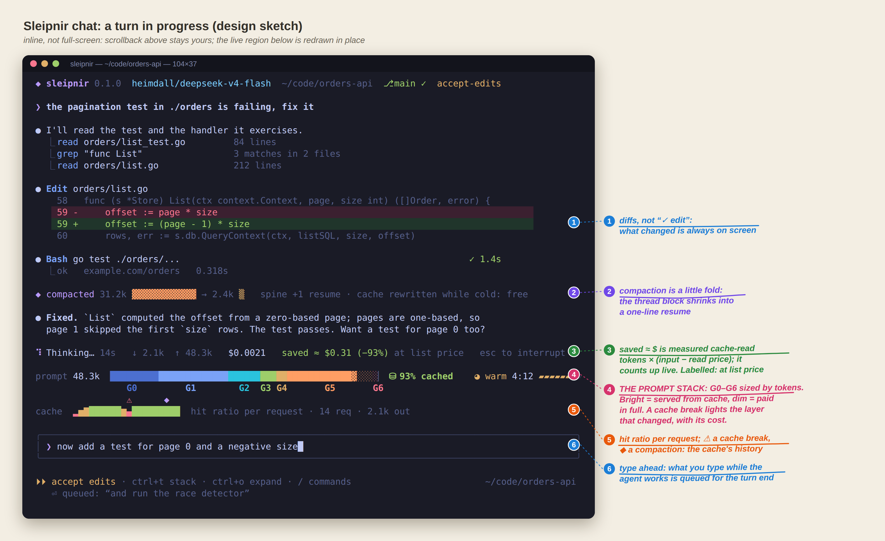
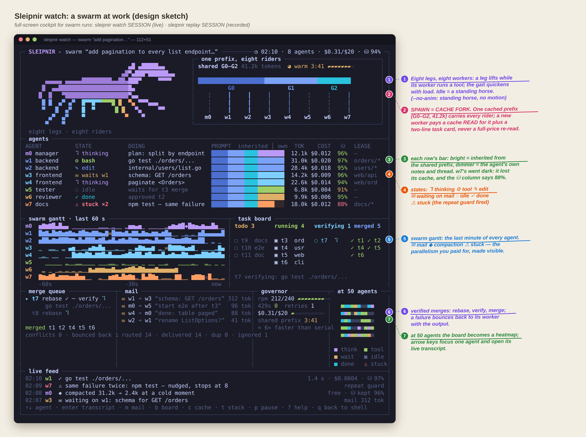
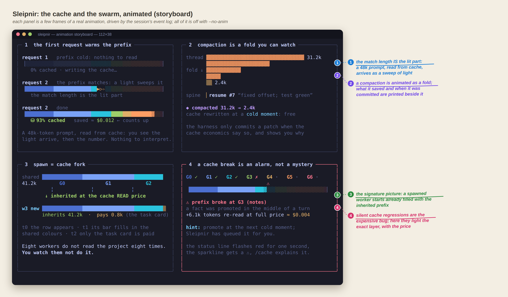
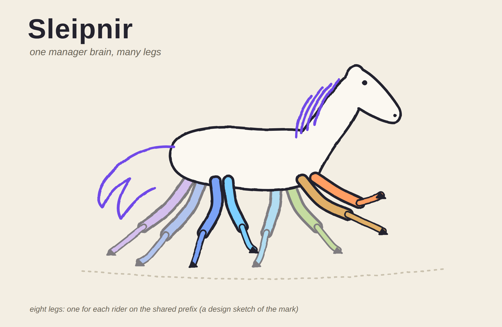

# The terminal interface

What `sleipnir chat`, `run`, `swarm`, `watch` and `replay` should look and feel like, why, and how it is built and tested.
The pictures are **design sketches** (`docs/design/ux/`, regenerated with `python3 make_sketches.py && node render.mjs ...`);
they are not screenshots of working code. As each piece lands, real recordings replace them.

| | |
|---|---|
|  |  |
|  |  |

## Where things stand

Today `chat` is a line REPL: no colour, no spinner or status line, no markdown, no diffs, typed `y/a/n` approvals
(`internal/session/sink.go`, `cmd/sleipnir/chat.go`). `sleipnir inspect` is a browser dashboard. Everything below is to be built.

## Principles

1. **Inline first.** The chat is not a full-screen application: output goes to the terminal's scrollback (so copy, search,
   tmux and SSH keep working) and only the last few lines, the *live region*, are redrawn in place. The one full-screen
   view is the swarm cockpit (`sleipnir watch`), because a dashboard wants the whole screen.
2. **The UI is a function of the event log.** Every pixel is a projection of `events.Event`s (`model.request`,
   `model.response`, `tool.*`, `agent.*`, `board.op`, `mail.*`, `lease`, `compact.*`, `cache.*`, `governor`, `perm.*`):
   the same stream the inspector and the RL exporters read. One reducer, `State = Reduce(State, Event)`, feeds the live chat,
   `watch` (tailing a running session's log), `replay` (a recorded one, at any speed, with no key) and the README recordings
   (rendered headless, deterministically). No second source of truth, no new instrumentation in the agent.
3. **Show what only Sleipnir knows.** The prompt stack and its cache state; what the cache saved, measured; what a spawn
   inherits; why a cache break happened. Everything else a harness shows (diffs, tool lines, approvals) is table stakes
   and must be at least as good as the best harness you have used.
4. **Motion is information, never decoration.** Every animation is driven by an event and means something (a sweep is a prefix
   match, a fold is a compaction, a lifted leg is a running tool). At most ~15 frames per second, only the cells that change
   are redrawn, and all of it is off with `--no-anim`, `SLEIPNIR_ANIM=0`, `REDUCE_MOTION=1`, `NO_COLOR`, `TERM=dumb` or a
   non-terminal.
5. **Everything degrades.** Truecolor, 256 colours, 16 colours, none; Unicode or ASCII; 60 to 200 columns; a resize at any
   moment. Piped output and CI logs stay plain lines exactly as today (`--plain` forces it).
6. **Untrusted text is data.** Model text, tool output, file contents and mail can carry escape sequences. Everything printed
   passes `tools.SanitizeForTerminal`; the markdown renderer emits only sequences it generated; no OSC 52 (clipboard), no
   OSC 8 links from model text, no images. Copying is an explicit command.
7. **Deterministic and testable.** Time comes from an injectable clock; animations are pure functions of (state, frame); the
   renderer is tested against a tiny VT emulator, so a golden screen is a plain text file.
8. **The UI never changes what the model sees.** Prompt bytes, tool lists and cache behaviour are untouched (AGENTS.md).

## Screens

**Chat (inline).** Scrollback: the banner; the prompt you typed; assistant text streamed as markdown (headings, lists, code
blocks, inline code); tool calls as `● Bash go test ./...  ✓ 1.4s` with the result beneath (`⎿`), long output collapsed
with `ctrl+o` to expand; edits as real diffs with line numbers; compactions as a one-line fold animation that stays as a
record; notices and retries (`(retrying: 429, in 4 s)`). Live region: the status line, the prompt stack bar, the cache
sparkline, the input box, the footer.

- *Status line:* spinner with a verb, elapsed time, tokens in and out, cost, **saved ≈ $ at list price** (measured cache-read
  tokens × (input − read price); labelled as such), `esc to interrupt`.
- *Prompt stack bar:* G0–G6 sized by tokens and coloured by volatility (cold blue to hot red); bright = served from cache, dim =
  paid in full; `▏` marks a provider cache breakpoint; the bar sweeps when a response shows the prefix matched; a TTL clock
  drains while idle and warns before the prefix goes cold.
- *Cache sparkline:* hit ratio per request, `⚠` a cache break, `◆` a compaction, `↻` an epoch.
- *Input:* multi-line (`alt+enter`, or `\` then enter), bracketed paste (a large paste becomes a `[pasted 312 lines]` chip),
  history (up/down, `ctrl+r` search, persisted), `/` commands with a filterable palette, `@path` completion, `!` for a shell
  line, typing ahead while the agent works (queued, delivered at the turn's end), `esc` (twice to clear), `ctrl+c` cancels
  the turn and never the session, a second press on an empty prompt quits, `ctrl+d` quits, `shift+tab` cycles the
  permission mode.
- *Permission dialog:* a box with the command or the diff and three keys, `1` yes, `2` yes and do not ask again for this
  prefix (per-project, see `SECURITY.md`), `3` no and say what to do instead; arrows and enter work too.
- *Panels on demand:* `ctrl+t` the stack in detail (layer, tokens, hash, cached, last change, TTL), `/cache` explains the last
  miss in words, `/context` the token grid by layer, `/agents` the swarm board.

**Swarm progress (inline).** `run --swarm` and `swarm` in a terminal show a compact live region: one line per active agent
(glyph, role, tool, tokens, hit %), the merge queue, the spend bar; `sleipnir watch` is the full thing.

**Watch (full screen).** The cockpit in the sketch: title bar with wall time, agents, spend, hit ratio; the eight-legged horse
(eight legs are eight workers: a leg lifts while its worker runs a tool, the gait follows the load, idle is a standing
horse; more than eight workers share the legs round-robin); the shared-prefix fan (one prefix, every rider); the agent table
with a per-agent prompt bar (inherited part bright, own part dimmer, a dark bar is a lost cache); the swarm gantt (last 60 s
per agent, `✉` mail, `◆` compaction, `⚠` stuck); the task board; the verified merge queue; mail; the governor; a live feed.
At more than ~16 agents the table becomes a heatmap (one cell per agent, coloured by state) and arrows focus one agent.

**Replay.** `sleipnir replay SESSION [--speed 8] [--until SEQ]` plays a recorded session through the same renderer, with
the animations, and needs no key: the demo for people who have not got a provider yet, and the way a bug report becomes a
movie. `sleipnir demo` is a replay of a scripted mock-provider session.

## The animations (each is a pure function of state and frame)

| Name | Trigger | What you see | Means |
|---|---|---|---|
| Sweep | `model.response` with a cached prefix | a light runs along the stack bar to the match length, then the hit ratio counts up | the prefix matched this far |
| Warm-up | first request of a prefix | the bar fills dim, then brightens on the next request | the cache was written, then read |
| Fold | `compact.commit` | the thread block shrinks step by step into a one-line resume; savings printed beside it | a compaction, and what it saved |
| Fork | `agent.spawn` | a new row appears; its bar fills from the left with the shared colours; only the task card is uncoloured | the worker inherits the prefix at read price |
| Break alarm | `cache.anomaly`, a miss against an expected read | the layer that diverged lights red, the status line flashes once, the sparkline gets `⚠`; the cost of the miss is printed | exactly where and why the cache broke |
| TTL drain | idle | the clock bar drains; turns amber at 60 s | the prefix is about to go cold |
| Gait | tool running in a worker | its leg lifts; the horse's pace follows the number of busy workers | parallelism |
| Mail | `mail.deliver` | an envelope glyph travels between the two rows | a message between agents |
| Merge | `board.op` merge stages | a chip moves rebase, verify, merge; a conflict bounces it back | verified integration |
| Spinner | waiting for the model | braille spinner with a verb that changes slowly | something is happening |

Colour roles are fixed so a screenshot reads without a legend: G0–G6 cold to hot (indigo, blue, teal, green, yellow, orange,
red); green is good (hit, pass), red is bad (miss, stuck, error), amber is waiting, violet is the harness itself.

## How it is built

Packages (all new; standard library, `golang.org/x/term`, `golang.org/x/sys` only):

- `internal/tui/term`: capability detection (colour depth, Unicode, size, synchronized output `?2026`, bracketed paste),
  raw mode, resize, `NO_COLOR`/`REDUCE_MOTION`/`SLEIPNIR_ANIM`; display width of runes (East Asian wide, emoji, combining).
- `internal/tui/cell`: `Style`, `Span`, `Line`, wrapping and truncation by display width. No escape codes in here.
- `internal/tui/render`: the renderer. Inline mode (scrollback printer + live region redrawn with cursor-up and erase,
  wrapped in synchronized output) and full-screen mode (alternate screen, cell-diff). One mutex, one writer, frames coalesced.
- `internal/tui/vt`: a minimal VT emulator (cursor movement, erase, SGR, scroll, wrap) used by the tests and by the headless
  recorder; a frame of the UI is a `[]string` plus styles that can be compared with a golden file.
- `internal/tui/widget`: pure `func(state, width, frame) []Line` widgets: spinner, stack bar, sparkline, TTL clock, gauge,
  table, box, markdown, diff, dialog, horse, heatmap, gantt, kanban, merge chips, mail flow.
- `internal/tui/state`: `State` and `Reduce(State, events.Event)`; also derives the **saved ≈ $** figure from `model.response`
  usage and the price table, with the assumption printed.
- `internal/tui/input`: the line editor (key decoding, editing, history, completion, paste) over a `Reader` of decoded keys.
- `internal/tui/app`: the programs (chat, progress, watch, replay) that connect an event source (live sink, log tail,
  recorded file) to the reducer and the renderer, and handle Ctrl-C per turn.
- `internal/tui/svg`: the headless recorder: replay a log with a virtual clock into frames and write an animated SVG (frames
  are the vt screen; identical consecutive frames merged) plus PNG stills via headless Chromium.

The live sink stays an `agent.Sink`, but it does not draw: it forwards to the same reducer as the log tail, so the chat and
`watch SESSION` (run from another terminal) show the same thing.

## Testing

- **Screens as golden text files** (`testdata/*.screen`): feed a scripted event sequence to the reducer at fixed virtual
  times, render to the VT emulator, compare. A changed pixel fails one named test; `-update` rewrites them (the same
  convention as the prompt goldens).
- **Renderer properties:** for random streams of "print N lines / update live region / resize", the emulator's final screen
  equals the expected scrollback plus live region; no output larger than necessary (a no-change frame writes nothing).
- **Width tables:** wide, combining and zero-width runes against known answers; wrapping never splits a cell.
- **Sanitising:** fuzz the markdown and tool-output paths: no byte in the output stream may be an escape sequence the
  renderer did not write.
- **pty end-to-end** (`internal/ptytest`, from the pty tests): the real binary in a pseudo-terminal: Ctrl-C mid-turn, paste,
  approval keys, resize, `--no-anim`, `NO_COLOR`, pipes stay plain.
- **Performance:** a swarm of 50 agents emitting events at full speed renders at most 15 fps and keeps the agents' latency
  unchanged (benchmark and an allocation gate on the reducer).

## Media

`scripts/record-demo.sh` runs `sleipnir demo` into a session directory, replays it headless into `docs/media/*.svg` (animated)
and `*.png` (stills), and the README embeds them. Recordings are generated from real event logs, never hand-edited, so a
change in the UI regenerates them in CI (`nightly`).

## Order of work

1. `term`, `cell`, `vt`, `render` (inline): the foundation, with the emulator-based tests.
2. `widget` (markdown, diff, spinner, stack bar, sparkline, box, dialog) and `state` (reducer + saved-$): chat looks right.
3. `input`: the editor, history, paste, completion; then the `app` chat program after the Ctrl-C and stdin fix (G1), which
   touches the same files.
4. Showpieces: sweep, fold, fork, break alarm, TTL; then the swarm widgets (horse, fan, gantt, heatmap, mail, merge) and `watch`.
5. `replay`, the headless recorder, the demo scenario, `docs/media`, README.

Acceptance: every screen above exists, is covered by a golden, degrades cleanly (`NO_COLOR`, `--plain`, pipe, 60 columns),
and a recording of `sleipnir demo` is in the README.
