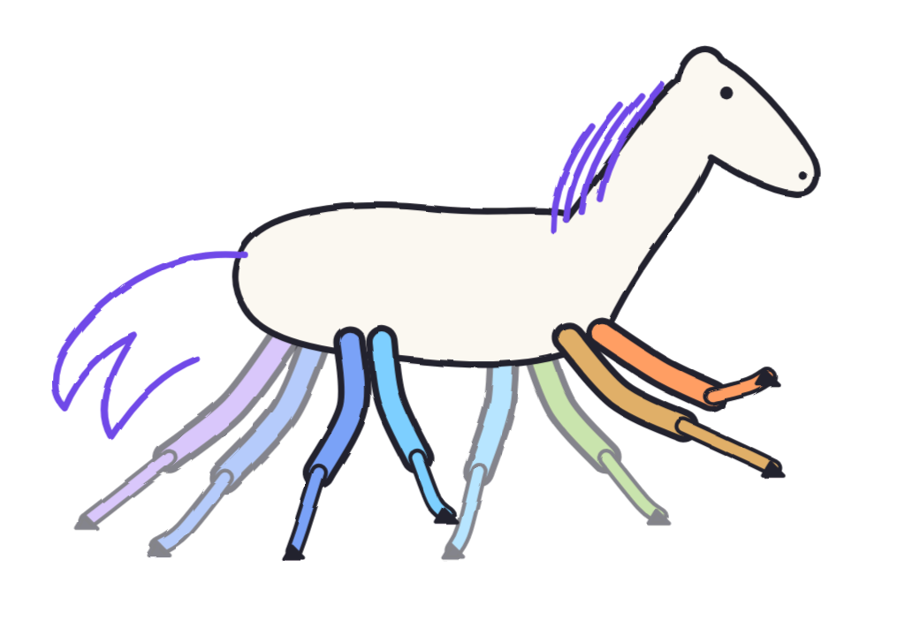

# Brand assets



The mark depicts an eight-legged horse. Leg colors correspond to terminal role
colors; the mane and tail use violet.

| File | Use |
| --- | --- |
| `logo.svg`, `logo.png` | Mark on light backgrounds |
| `logo-dark.svg` | Mark on dark backgrounds |
| `logo-wordmark.svg`, `logo-wordmark.png`, `logo-wordmark-dark.svg` | Mark with name |
| `favicon.svg` | Small icon |
| `social-preview.png` | Repository social preview |

Keep clear space around the mark, preserve all eight legs, and retain its aspect
ratio and role colors. Use the favicon below 48 pixels wide.

Regenerate from this directory:

```sh
python3 make_logo.py
node render.mjs logo.html wordmark.html social.html favicon-test.html
```

Rendering requires Playwright Chromium. Wordmark lettering uses paths to avoid
font-dependent clipping. `wordmark-paths.json` contains the glyph outlines; update
it with `outline_text.py` when changing the font or text, then regenerate assets.

## Terminal fixtures

`gallery.json` lists the scripted interface recordings. `showcase/events.jsonl`
and `chat/transcript.jsonl` supply their events and input. Regenerate with
`scripts/record-demo.sh`; `--check` verifies that the SVGs match those fixtures.
Provider recordings use `scripts/record-real.sh`.

See [Gallery](../GALLERY.md) for recording provenance. Fixture cache events,
prices, and timing do not establish live endpoint performance.
